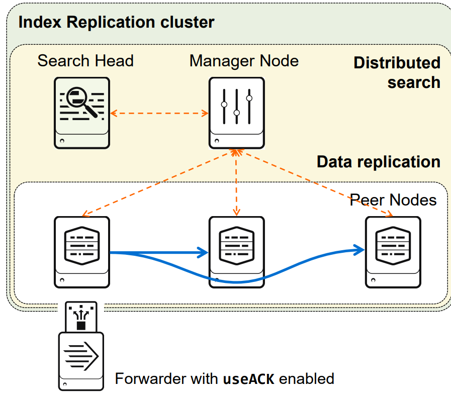
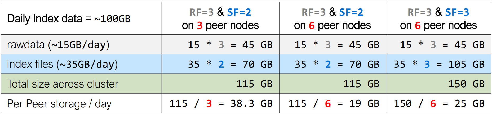
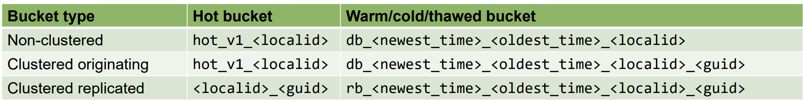

| |Indexer|Search Head|
|----|----|----|
OS|Linux or Windows 64-bit distribution|
Network|1Gb Ethernet NIC (optional second NIC for a management network)
Memory|12 GB RAM
CPU | Intel 64-bit chip architecture,12 CPU cores,Running at 2+ GHz|Intel 64-bit chip architecture,16 CPU cores,Running at 2+ GHz
Disk|Disk subsystem capable of 800 IOPS|2 x 10K RPM 300GB SAS drives - RAID 1 


| |High Availability (HA) | Disaster Recovery (DR)
|----|----|----|
Indexing Tier| Single-site cluster • Index replication • Flexible replication policies| Multisite cluster • Can withstand entire site failure • Supports active-passive and active-active configurations • SmartStore reduces the storage footprint while maintaining HA/DR
Search Tier| • Search head or • Search head cluster|Search affinity (site-aware) • Search head or • Search head cluster

----


----

# Manager node
<!--  -->

There can only be one cluster manager
> Controls and manages index replication
> Distributes app bundles to peer nodes
> Tells the search head which peers to search
# Peer nodes
> Index data from inputs/forwarders
> Replicate data to other peer nodes as instructed
by the manager
# Search head
> Required component of indexer cluster
> Relies on the manager for its target search peers
> Works the same as any Splunk search head

===


## Benefits of indexer clustring
```
• Data availability and fast recovery
• Easier overall administration
    > Coordinated indexer configuration management
    > Automatic distributed search setup
    > Elastic indexer discovery
    > Indexer peer node status dashboard on the manager node
• Scale-out indexing capacity
• No additional cost for data replication
```

## Considerations when going with indexer clustering
```
• Increased storage requirements
• Increased processing load
    Depending on the replication & search factors
• Requires additional Splunk instances
    – Minimum:
        Replication Factor (RF) + MN + SH
    – Recommended:
        More than RF + MN + more SHs
• No support for heterogeneous indexers
    – Requires same OS and Splunk versions
• Requires cluster-specific deployment management
```

## Requirements
```
• Each node must run on its own host
• The manager node must run the same or a later version than the peer nodes and search heads
    – Can run at most three minor versions later than the peer nodes
        9.1 manager node can run against 9.1 and 9.0
• The search heads must run the same or a later version than the peer nodes
• All peer nodes must run EXACTLY the same version
• Peer node storage requirements:
    – Ability to sustain 800 IOPS for each peer node
    – The ratio of disks to disk controllers should mimic a database system requirement
• Cluster recovery depends upon system resources available on manager node
```


## Key Specifications
> • Peer nodes copy buckets to other peer nodes (index replication)
>    – The copied buckets may be searchable buckets or contain only rawdata
> #### Replication factor
>    – Specifies how many total copies of rawdata the cluster should maintain
>    – Sets the total failure tolerance level
> #### Search factor
>    – Specifies how many copies are searchable
>        A searchable bucket contains both rawdata and index files
>        Its rawdata is counted as a part of the replication factor
>    – Cannot be larger than the replication factor
>    – Determines how quickly you can recover the search capability
>        A trade-off between disk usage and search availability
> #### Security key (pass4SymmKey)
>    – Authenticates communication between the cluster nodes
>    – The key must be the same across all cluster instances

### Capacity planning:
#### Example:

    Daily index data = ~100GB

    • rawdata on disk = ~15% of daily index data

    • index files on disk = ~35% of daily index data



-------
### Configuring Manager Node
Run this on #SPLUNK_HOME of Manager node

```
 splunk edit cluster-config -mode manager -replication_factor 3 -search_factor 2 -secret myclusterpass4symmkey
```
Above command will create below server.conf config file in 

$SPLUNK_HOME/etc/system/local/server.conf
```python
[clustering]
mode = manager
replication_factor = 2
pass4SymmKey = Hashed_Secret
```
### Configuring the Peer Nodes
Run this on #SPLUNK_HOME of Manager node

```
 splunk edit cluster-config -mode peer -manager_uri https://<<MANAGER IP/HOSTNAME>>:8089 -secret myclusterpass4symmkey -replication_port 9887
```
Above command will create below server.conf config file in 

$SPLUNK_HOME/etc/system/local/server.conf
```python
[clustering]
mode = peer
manager_uri = https://<<MANAGER IP/HOSTNAME>>:8089
pass4SymmKey = Hashed_Secret

[replication_port://9887]
```
### Configuring the Search Head

Run this on #SPLUNK_HOME of Manager node

```
 splunk edit cluster-config -mode searchhead -manager_uri https://<<MANAGER IP/HOSTNAME>>:8089 -secret myclusterpass4symmkey
```
Above command will create below server.conf config file in 

$SPLUNK_HOME/etc/system/local/server.conf
```python
[clustering]
mode = searchhead
manager_uri = https://<<MANAGER IP/HOSTNAME>>:8089
pass4SymmKey = Hashed_Secret
```
We can add multiple indexer clusters to a search head. To add multiple we can do it via configuration file or CLI

```
splunk add cluster-manager -manager_uri https://<MANAGER IP>:8089 -secret yourClusterSecret
```
Above command will create below server.conf config file in 

```
[clustering]
mode = searchhead
manager_uri = clustermanager:USE1, clustermanager:USW2

[clustermanager:USE1]
manager_uri = https://<Manager1 IP>:8089
pass4SymmKey = Hashed_Secret1

[clustermanager:USW2]
manager_uri = https://<Manager2 IP>:8089
pass4SymmKey = Hashed_Secret2
```


### Replicated Buckets 
