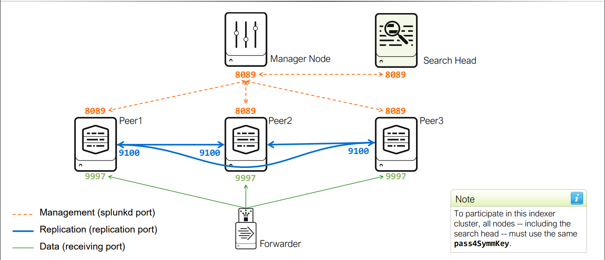
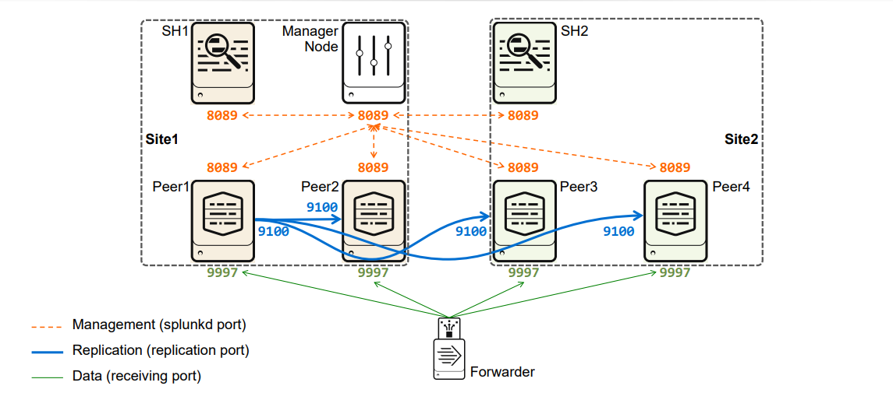
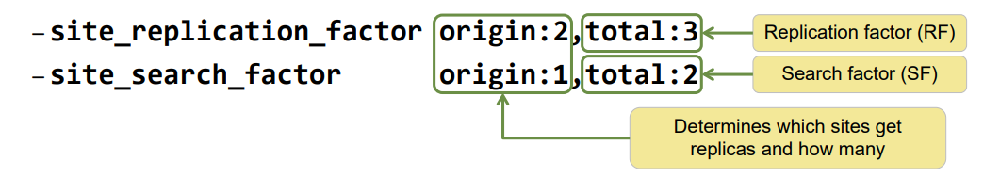

| |Indexer|Search Head|
|----|----|----|
OS|Linux or Windows 64-bit distribution|
Network|1Gb Ethernet NIC (optional second NIC for a management network)
Memory|12 GB RAM
CPU | Intel 64-bit chip architecture,12 CPU cores,Running at 2+ GHz|Intel 64-bit chip architecture,16 CPU cores,Running at 2+ GHz
Disk|Disk subsystem capable of 800 IOPS|2 x 10K RPM 300GB SAS drives - RAID 1 


| |High Availability (HA) | Disaster Recovery (DR)
|----|----|----|
Indexing Tier| Single-site cluster • Index replication • Flexible replication policies| Multisite cluster • Can withstand entire site failure • Supports active-passive and active-active configurations • SmartStore reduces the storage footprint while maintaining HA/DR
Search Tier| • Search head or • Search head cluster|Search affinity (site-aware) • Search head or • Search head cluster

----


----

# Manager node
<!--  -->

There can only be one cluster manager
> Controls and manages index replication
> Distributes app bundles to peer nodes
> Tells the search head which peers to search
# Peer nodes
> Index data from inputs/forwarders
> Replicate data to other peer nodes as instructed
by the manager
# Search head
> Required component of indexer cluster
> Relies on the manager for its target search peers
> Works the same as any Splunk search head

===


## Benefits of indexer clustring
```
• Data availability and fast recovery
• Easier overall administration
    > Coordinated indexer configuration management
    > Automatic distributed search setup
    > Elastic indexer discovery
    > Indexer peer node status dashboard on the manager node
• Scale-out indexing capacity
• No additional cost for data replication
```

## Considerations when going with indexer clustering
```
• Increased storage requirements
• Increased processing load
    Depending on the replication & search factors
• Requires additional Splunk instances
    – Minimum:
        Replication Factor (RF) + MN + SH
    – Recommended:
        More than RF + MN + more SHs
• No support for heterogeneous indexers
    – Requires same OS and Splunk versions
• Requires cluster-specific deployment management
```

## Requirements
```
• Each node must run on its own host
• The manager node must run the same or a later version than the peer nodes and search heads
    – Can run at most three minor versions later than the peer nodes
        9.1 manager node can run against 9.1 and 9.0
• The search heads must run the same or a later version than the peer nodes
• All peer nodes must run EXACTLY the same version
• Peer node storage requirements:
    – Ability to sustain 800 IOPS for each peer node
    – The ratio of disks to disk controllers should mimic a database system requirement
• Cluster recovery depends upon system resources available on manager node
```


## Key Specifications
> • Peer nodes copy buckets to other peer nodes (index replication)
>    – The copied buckets may be searchable buckets or contain only rawdata
> #### Replication factor
>    – Specifies how many total copies of rawdata the cluster should maintain
>    – Sets the total failure tolerance level
> #### Search factor
>    – Specifies how many copies are searchable
>        A searchable bucket contains both rawdata and index files
>        Its rawdata is counted as a part of the replication factor
>    – Cannot be larger than the replication factor
>    – Determines how quickly you can recover the search capability
>        A trade-off between disk usage and search availability
> #### Security key (pass4SymmKey)
>    – Authenticates communication between the cluster nodes
>    – The key must be the same across all cluster instances

### Capacity planning:
#### Example:

    Daily index data = ~100GB

    • rawdata on disk = ~15% of daily index data

    • index files on disk = ~35% of daily index data


-------
### Configuring Manager Node
Run this on #SPLUNK_HOME of Manager node

```
 splunk edit cluster-config -mode manager -replication_factor 3 -search_factor 2 -secret myclusterpass4symmkey
```
Above command will create below server.conf config file in 

$SPLUNK_HOME/etc/system/local/server.conf
```python
[clustering]
mode = manager
replication_factor = 2
pass4SymmKey = Hashed_Secret
```
### Configuring the Peer Nodes
Run this on #SPLUNK_HOME of Manager node

```
 splunk edit cluster-config -mode peer -manager_uri https://<<MANAGER IP/HOSTNAME>>:8089 -secret myclusterpass4symmkey -replication_port 9887
```
Above command will create below server.conf config file in 

$SPLUNK_HOME/etc/system/local/server.conf
```python
[clustering]
mode = peer
manager_uri = https://<<MANAGER IP/HOSTNAME>>:8089
pass4SymmKey = Hashed_Secret

[replication_port://9887]
```
### Configuring the Search Head

Run this on #SPLUNK_HOME of Manager node

```
 splunk edit cluster-config -mode searchhead -manager_uri https://<<MANAGER IP/HOSTNAME>>:8089 -secret myclusterpass4symmkey
```
Above command will create below server.conf config file in 

$SPLUNK_HOME/etc/system/local/server.conf
```python
[clustering]
mode = searchhead
manager_uri = https://<<MANAGER IP/HOSTNAME>>:8089
pass4SymmKey = Hashed_Secret
```
We can add multiple indexer clusters to a search head. To add multiple we can do it via configuration file or CLI

```
splunk add cluster-manager -manager_uri https://<MANAGER IP>:8089 -secret yourClusterSecret
```
Above command will create below server.conf config file in 

```
[clustering]
mode = searchhead
manager_uri = clustermanager:USE1, clustermanager:USW2

[clustermanager:USE1]
manager_uri = https://<Manager1 IP>:8089
pass4SymmKey = Hashed_Secret1

[clustermanager:USW2]
manager_uri = https://<Manager2 IP>:8089
pass4SymmKey = Hashed_Secret2
```


### Replicated Buckets 


----
----
# Multisite Indexer Cluster



Multisite Indexer Cluster offers 

    1. Disaster Recovery

    2. Search Affinity
        > Search heads Search data that belongs to that site
        > Reduces Network traffic
    
    NOTE: To search across sites 

### Components/attributes for multisite indexer cluster:

1. multisite
2. site
3. available_sites --> can be max of 63 sites
4. site_replication_factor
5. site_search_factor



total count cannot be less than count of factors (origin + sites )

example: origin:2, site1:2, site2:2, total:3 --> which is invalid
```
available sites - site1, site2

    origin=2
+   site2=4
Total= 4 --> but mentioned as 3 in config which is ivalied

    origin=2
+   site1=4
Total= 4 --> but mentioned as 3 in config which is ivalied


```

## Configure Multisite Manager Node 
```
splunk edit cluster-config -mode manager -multisite true -site site1 -available_sites site1,site2 -site_replication_factor origin:1,total:2 -site_search_factor origin:1,total:2 -secret myclusterpass4symmkey
```
Above command will create below server.conf config file in  $SPLUNK_HOME/etc/system/local/server.conf

```
[general]
site = site1

[clustering]
multisite = true
mode = manager
available_sites = site1,site2
site_replication_factor = origin:1,total:2
site_search_factor = origin:1,total:2
pass4SymmKey = Hashed_Secret
```

## Configure Multisite Cluster peers

#### On Site1 peers
```
splunk edit cluster-config -manager_uri https://<ManagerIP>:8089 -mode peer -site site1 -replication_port 9887 -secret myclusterpass4symmkey
```
Above command will create below server.conf config file in  $SPLUNK_HOME/etc/system/local/server.conf

```
[general]
site = site1

[clustering]
mode = slave
manager_uri= https://<ManagerIP>:8089
pass4SymmKey = Hashed_Secret

[replication_port://9887]
```

#### On Site1 peers
```
splunk edit cluster-config -manager_uri https://<ManagerIP>:8089 -mode peer -site site2 -replication_port 9887 -secret myclusterpass4symmkey
```
Above command will create below server.conf config file in  $SPLUNK_HOME/etc/system/local/server.conf

```
[general]
site = site2

[clustering]
mode = slave
manager_uri= https://<ManagerIP>:8089
pass4SymmKey = Hashed_Secret

[replication_port://9887]
```

## Configure Multisite indexer cluster Search Head 
```
splunk edit cluster-config -mode searchhead -manager_uri https://<ManagerIP>:8089 -site site1 secret myclusterpass4symmkey
```
Above command will create below server.conf config file in  $SPLUNK_HOME/etc/system/local/server.conf

```
[general]
site = site1

[clustering]
multisite = true 
mode = searchhead
manager_uri= https://<ManagerIP>:8089
pass4SymmKey = Hashed_Secret
```

#### To disable search affinity 
Replace -site site1 with -site site0

OR

edit server.conf
```
[general]
site = site0

```


## Search Affinity
```
• In single-site indexer cluster, there is only one set of “primary” searchable buckets that respond to searches

• With multisite, each site can have searchable replicas that respond to searches

• Search affinity (enabled by default)

    >  Search heads have a site association

    >  Searches get as many events as they can from the same site

        > If a searchable bucket exists on the site, it will be the primary bucket for that site
        > Searches will extend across sites only when they are needed
        
    >  Limit the access of each user to only their local search heads

Serch Affinity can be disabledw by assigning site=0 on Search head

site=0 --> is applicabble only to Search head (Not on peers)

When Search affinity is disabled:

    > Spread the search request across indexers on all sites
    > Will increase WAN traffic

    all sites in the cluster must be in close proximity with very low network latency
```

### Maintenance Mode in Cluster:
Maintenance mode halts most bucket fixup activity and prevents frequent rolling of hot buckets. It is useful when performing peer upgrades and other maintenance activities on an indexer cluster. Because it halts critical bucket fixup activity, use maintenance mode only when necessary.

Reference link: https://help.splunk.com/en/splunk-enterprise/administer/manage-indexers-and-indexer-clusters/9.4/manage-the-indexer-cluster/use-maintenance-mode

## Commands for administrating Cluster

### Single site
Maintenance mode commands
```
splunk enable maintenance-mode 
splunk disable maintenance-mode
splunk show maintenance-mode
```
Below commands should be executed on manager node

```
# Below two commands automatically invoke maintenance mode

splunk apply cluster-bundle
splunk rolling-restart cluster-peers
```
```
splunk show cluster-bundle-status [--verbose]
splunk validate cluster-bundle --check-restart
splunk rollback cluster-bundle
splunk show cluster-status [--verbose]
splunk list excess-buckets [index]
splunk remove excess-buckets [index]
```

Below commands should be executed on Peer node

```
# to bring down a peer temporarily 
splunk offline 

# to bring down a peer Permanently
splunk offline --enforce-counts


```


### Multi site
```
splunk rolling-restart cluster-peers -site-by-site true -site-order site2,site1

```