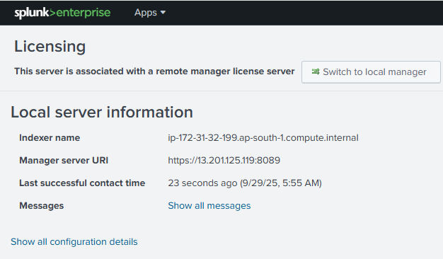
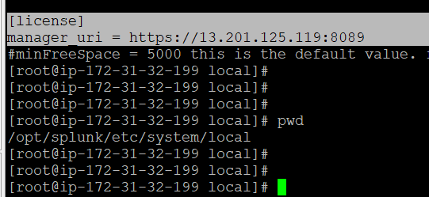
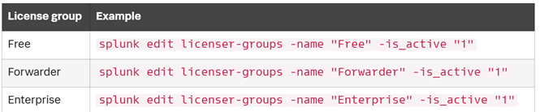
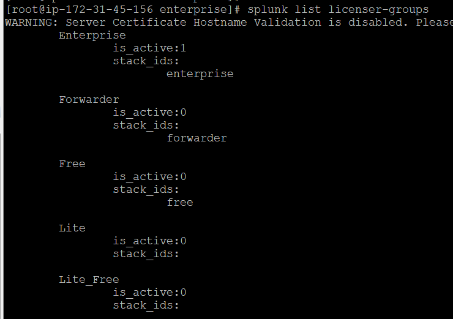
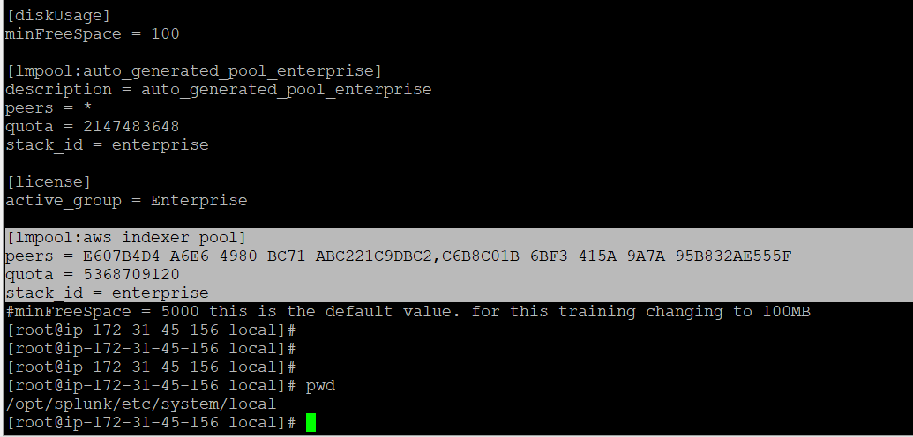
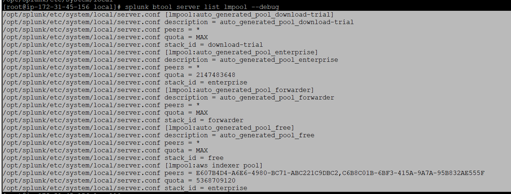
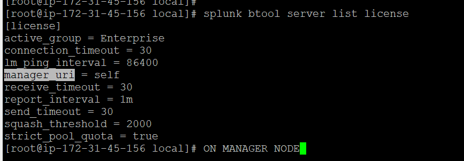
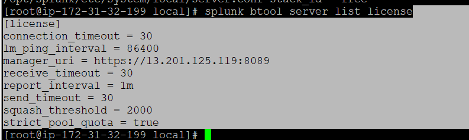

# License's in Splunk

-   License Types
-   License warinings & Violations
-   Installing, managing and monitoring Licenses

## License Types 
### Splunk Enterprise Trial license
-   This license is enabled by default
    -   A fresh installation of Splunk enterprices ships with default license with `validity 60days` and data limit ingestion of `500 MB per day`. If data ingestion increased beyond 500MB then a warning will be triggered.
    -   This license allows you to use full features of Splunk Enterprise.

### Splunk Free license
-    This license is valid forever and supports only a subset of Splunk Enterprise features
    -   Following features are disabled
        -   Alerting
        -   Authentication
        -   Clustering
        -   Distributed search
        -   Summaries
        -   Forwarding to non-Splunk servers
    -   The daily data ingestion limit is `500 MB`. License violations block the search functionality

### Forwarder License
-   Splunk offers a variety of forwarders. The most popular ones are the universal forwarder (UF) and heavy forwarder (HF).
-   The UF is by default embedded with the license, so there is `no need for explicit license installation/configuration`
-   The HF is a full Splunk Enterprise instance binary that requires either a Forwarder license or an Enterprise license.
-   The Forwarder license is by default embedded into the Splunk Enterprise package
-   No indexing is allowed on HFs with the Forwarder license. However, authentication is allowed.

### Splunk Enterprise license
-   This license must be purchased from Splunk
-   This license limits the per-day indexed data capacity
-   This enables all the enteprise features of Splunk
-   A license with 
    -   `>100GB` per day does not experience any disruptions/ no service breaks
    -   `<100GB` will block searching after 45 warnings in a 60day rolling window
-   More than one enterprise license can be stacked and allocated to license pools.

### Splunk Enterprise infrastructure license
-   This license must be purchased from Splunk with reference to the number of vCPUs. It allows the full set of enterprise features.
-   More than one enterprise infrastructure license can be stacked and allocated to license pools.
-   The Splunk Enterprise infrastructure license cannot be stacked with the Splunk Enterprise license.

### Splunk Developer license
-   This license is for Splunk app developers to utilize Splunk Enterprise to develop and test apps. It enables the full set of Splunk Enterprise features. Here are the features of this license:
    -   It allows 10 GB a day of data. Exceeding the data size will raise license warnings. Searching will be blocked if the number of warnings exceeds the limit.
    -   It is issued for a 6-month validity period. A renewal request can be raised to extend the license.
    -   It cannot be stacked with any other licenses.

##  License warnings and violations
The license types, whether purchased from Splunk or free, enforce limits, except the infrastructure license, which counts the number of vCPUs and doesn’t enforce license violation limitations. The rest of the license types enforce limits on data volume or indexed data volume per day.

If a license exceeds the allowed data volume per day, Splunk Enterprise will raise a license warning. When the number of warnings exceeds a certain threshold, it is called a license violation.

License warnings appear in Splunk web administrative messages. They persist for a number of days in order for system administrators to resolve them. License usage alerts can be enabled in the monitoring console.

License violation disables important Splunk features, which means that only a subset of features will be available during the violation period. 
-   Search functionality, which includes reports and alerts, will be blocked, except for internal indexes such as _internal, _audit, and _introspection
-   Indexing of data will continue for indexers

| |# of Warnings for violation|Warnings perists for|Impact|Reset Option|
|----|----|----|----|----|
Splunk Enterprise Trial license|5 or more warnings in 30days rolling window is a violation|14days|searching is blocked and indexing continues|No reset option, have to reinstall whole instance
Splunk Free license|3 or more warnings in a 30days rolling window is a violation|14days|searching is blocked and indexing continues|No reset option, have to reinstall whole instance
Splunk Enterprise license (>= 100GB/day)|Does not enforce license warnings and violations| - | -
Splunk Enterprise license (< 100GB/day)|45 or more warnings in a rolling 60-day period is a violation||searching is blocked while indexing continues|Contact splunk support to reset Key
Splunk Enterprise infrastructure license | No violations
Splunk Developer license|5 or more warnings in a 30days rolling window is a violation|14days|searching is blocked and indexing continues|Contact Splunk developer program team
Splunk Forwarder license|No violations


Below are not metered against License
```
Splunk internal indexes doesnt count in a License quota
Replicated copies stored in Indexer cluster are not counted/metered against license
Summary indexes with the stash source type
```

Note: License quotas are measured every day, from midnight to midnight, The data size is calculated during the indexing phase. Metrics index data is capped at 150 bytes per event, and event index data is calculated based on the full size of the events


A dedicated instance works as the license manager, in which the license file is installed and configured; the remaining instances function as license peers and report to the license manager in a distributed deployment.


## Adding licenses in Splunk
>   Two methods
-   Web UI
    -   Settings --> License
- CLI
    -   splunk add licenses <path_to_license_file_required>

Above both methods will create files/folders in `$SPLUNK_HOME/etc/licenses`


License groups
- can have multiple groups but only one can be active at a time
License stacks
License pool

License grouping organizes license stacks into categories like Enterprise or Free, with only one group active at a time, while license pooling divides the volume of a license stack into smaller, shareable amounts, creating pools that specific indexers can draw from, allowing for flexible allocation of indexing volume. License groups are the largest container, followed by license stacks within them, and then the pools created from those stacks


### License manager and License Peer
-   A license manager is a Splunk Enterprise instance that is configured to act as a centralized license server, and the rest of the instances in the deployment report to this server. 
-   The remaining instances in deployment that are configured to report to the manager instance are called license peers. 
-   The license stacks, pools, and their volume allocation are configured on the manager instance

A lincense Peer can be configured in 3 ways
-   web
    -   Settings --> Licensing --> chnage to peer
- CLI
    -   splunk edit licenser-localpeer -manager_uri 'https://<license_manager_host>:<port>'
- Config
    -   server.conf
        [license]
        manager_uri = https://Licensemanager:8089



Commands:
```
splunk add licenses <absolute path to file>
splunk list licenses
splunk list licenser-localpeer
splunk list licenser-peers
splunk list licenser-messages
splunk list licenser-groups
splunk edit licneser-groups <group> -is_active 1
splunk add licenser-pools pool01 -quota 10mb -peers guid1,guid2 -stack_id enterprise
splunk remove licenser-pools pool01
splunk remove licenses BM+S8VetLnQEb1F+5Gwx9rR4M4Y91AkIE=781882C56833F36D

```


ON MANAGER NODE








ON PEER NODE

