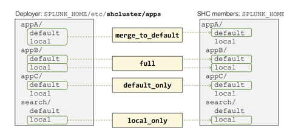
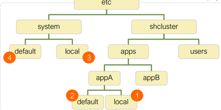
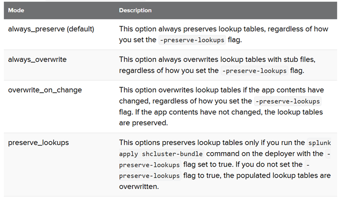

# Search Head Clustering


----
### Why SearchHead clustering
To overcome
>   Single point of failure

>   User load management issues

>   Maintaining consistent configs/KOs on multiple Search heads

### Benefits of  SearchHead clustering
> Can be scaled up and down (vertically) and Horizontally (by adding nodes) based on userload and High availability

> Searches, Search artifacts, KOs high availability.

> No downtime when upgrading/during any maintenance activies.

### Requirements
-   All memebers/search heads in a cluster should have same specifications and OS arch
-   Minimum of 3 nodes are needed to build SH cluster
-   Synchronize the system clock on all members including the indexing layer


###  SearchHead cluster
-   Search head cluster works on cluster-Memeber concept where as in Indexer cluster it works on Manager-peer concept
-   Server Roles in  SearchHead clustering
      - Captain of SearchHead cluster
      - Memeber of SearchHead cluster
      - Primary of KV store
      - Deployer
-   We can have max `50` search heads in a Search head cluster

- Captain of SearchHead cluster:
    -   It is the job scheduer in whole cluster where it distributes/delegates searches to members.
    -   All Scheduled searhes are delegated to members of cluster
    -   scheduler on enabled only on captain
    -   Shares Knowledge bundle with peer nodes.
    -   Makesures replication of search artifactes of scheduled searhces are replicated to memeber as per replication factor
    -   <b>Note</b>: adhoc searches/realtime searche artifacts are not replicated to other members. When user tries to fetch those results/artifacts search head will proxy to the memeber where artifacts are generated/stored.
    -   Captain functions as a source control server
        -   Members replicate changes from/to captain every `5 seconds` (replication cycle)
        -   Members generate a snapshot `every minute` and purge old sets `every hour`
            -   /opt/splunk/var/run/splunk/snapshot/*.bundle

Search artifacts are stored in `/opt/splunk/var/run/splunk/dispatch/`

If there are any changes to configs/KOs all members keep a journal of changes in etc/system/replication/ops.json


- Member of SearchHead cluster:
    -   It receives instructions from captain on what scheduled search need to run.
    -   based on captian instruction and replication factor, scheduled search artifacts are replicated to other members of cluster.
    -   Scheduler on member nodes are suppressed within cluster
    -   members dont share Knowledge bundle with peer nodes.
    -   User can login to any memeber to search data.

##  Capitancy in Splunk Search head cluster
-   There are 2 types of captaincy 
    -   Dynamic Captaincy --> memebers of cluster elects one of the memeber as captain when current captain is down
    -   Static Captaincy --> it is manual election by splunk admin when there is no required/majority of members in cluster

-   For dynamic Captaincy splunk uses RAFT mechanism to elect the captain
    -   all logs releated to this election will persist in `/opt/splunk/var/run/splunk/_raft/<server>/log`

-   Members register their list of artifacts,running jobs, alerts, and search load statistics to a new captain
-   New captain enables its scheduler
-   New captain executes fixups if needed

----
## Deployer
It is a management component in Splunk, where it is used to stage and push apps/configurations to Splunk Search Head cluster memebers.
SearchHead Cluster memebers doesnt have direct dependency on deployer  (like peers are fully managed by Manager node in indexer clustering)

We can stage apps and can send/push apps later as well in SHC deployer.

Staging Location on Deployer
`/opt/splunk/etc/shcluster/apps/`


NOTE:
```
Use the deployer to distribute apps and non-replicable files into a SHC
– Does not represent a "single source of truth"
– Cannot use it alone to restore members to the latest state
```

### To build/create a Deployer
Deployer should be installed on a non SH member/on a new instance.

Only config method can be used to use a Splunk instance as Deployer

To use a splunk instance as Deployer place below config in `server.conf`
```
[shclustering]
pass4SymmKey = mySecreteSHCluster
shcluster_label = Splunk_sessions
```

Place all the configurations/apps to be pushed to SH memebers in staging location and can be pushed to -target (can be any memeber of cluster), which will be pused to all the members of the cluster.
```
splunk apply shcluster-bundle -target <member:port> -action stage
splunk apply shcluster-bundle -target <member:port> -action send

# To restart SH Cluster memebers (RUN ON ANY MEMBER OF SHC)
splunk rolling-restart shcluster-members

# TO CHECK STATUS OF ROLLING RESTART
splunk  rolling-restart shcluster-members -status 1

```
----
# Building a Search head cluster
### Steps:
1.  Start Splunk on all the nodes
2.  Initialize SH cluster on all members by executing below command
```
splunk init shcluster-config -auth <username>:<password> -mgmt_uri <URI>:<management_port> -replication_port <replication_port> -replication_factor <n> -conf_deploy_fetch_url <URL>:<management_port> -secret <security_key> -shcluster_label <label>

splunk restart
```
```
example:

splunk init shcluster-config -auth admin:changeme -mgmt_uri https://10.1.1.1:8089 -replication_port 9200 -replication_factor 3 -conf_deploy_fetch_url https://10.1.1.0:8089 -secret mySecreteSHCluster -shcluster_label Splunk_sessions

```
3.  Select one of the initialized instances to be the first cluster captain. It does not matter which instance you select for this role.
```
splunk bootstrap shcluster-captain -servers_list "https://SH2:8089,https://SH3:8089,https://SH4:8089" -auth admin:Changeme123
```

Optional:
```
In future if you want to add or remove nodes from existing cluster
---------------- TO ADD -----------------
#command to run on new memeber
splunk add shcluster-member -current_member_uri <URI>:<management_port>

#Command to run from existig memener to add a new memeber
splunk add shcluster-member -new_member_uri <URI>:<management_port>


---------------- TO REMOVE -----------------
#To remove current node (SH3)
splunk remove shcluster-member

#To remove SH3 from SH2
splunk remove shcluster-member -mgmt_uri https://SH3:8089
```


4.  To check the overall status of your search head cluster, run this command from any member
```
splunk show shcluster-status -auth <username>:<password>
```
5.  In addition to checking the status of the search head cluster itself, it is also advisable to check the status of the KV store running on the cluster. Run this command from any member:
```
splunk show kvstore-status -auth <username>:<password>
```
6. To connect to indexer cluster manager node


-   Run below command when 
    -    When SHC can't elect a captain, run on all members before bootstrap
    -   When SHC has an active captain but a member can't join, run on the failing members
    ```
        splunk clean raft
    ```

----
----
## Deployer Push methods
-   One can push only local configs of a app / default configs / both to SH members.

deployer_push_mode = merge_to_default | full | default_only | local_only




This can be controlled per app level/at system level in app.conf

File precedence for PUSH method:



```
[shclustering]
deployer_push_mode = merge_to_default | full | default_only | local_only
deployer_lookups_push_mode = always_preserve | always_overwrite |overwrite_on_change |preserve_lookups
```


```
splunk apply shcluster-bundle -target member -preserve-lookups true
```
----
----

## KVStore Cluster:
-   Within a SHC, the KV store forms its own cluster
-   KV store port must be accessible from all SHC members
    -    Uses 8191 by default
-   SHC captain and KV store primary synchronize their member list every time there is a status change
-   The primary receives all write operations and records them in its journal
-   The secondaries copy and apply these operations asynchronously
-   Writes are acknowledged when:
    -   The majority of voting KV store nodes have applied the operations
    -   The writes have successfully been logged to their respective journals 
-   READ operations can be done on any member

----
### Commands:
```
splunk transfer shcluster-captain -mgmt_uri <new_captain>

splunk rolling-restart shcluster-members --> This will invoke automatics captaincy transfer

# To convert dynamic captiancy to static --> Make election as false on all nodes and make one as caption

# on the node to be captain (mode as captain)
splunk edit shcluster-config -election false -mode captain -captain_uri https://SH3:8089

# on all other memeber nodes (mode as member)
splunk edit shcluster-config -election false -mode member -captain_uri https://SH3:8089

------------------------------------------------------
To restore dynamic captiancy

# once majorty members are back, run this on returned members
splunk edit shcluster-config -election false -mode member -captain_uri <URI>:<management_port> 

# Once cluster retains stable state

# run on all members except on current static captaion
splunk edit shcluster-config -election true -mgmt_uri <THIS_MEMBER>:8089

# Bootstrap one of the members. This member then becomes the first dynamic captain. It is recommended that you bootstrap the member that was previously serving as the static captain
splunk bootstrap shcluster-captain -servers_list <SEARCH_HEAD_MEMBER_LIST>


------------------------------------------------------

# If unable to fully recover, you can force the resync on the re-joining member
splunk resync shcluster-replicated-config

------------------------------------------------------
KV Store commands
splunk show kvstore-status --verbose
splunk clean kvstore -local
splunk resync kvstore [-source <KVstore_source_GUID>]


TO TAKE BACKUP AND RESTORE OF KVSTORE:
https://docs.splunk.com/Documentation/Splunk/9.4.2/Admin/BackupKVstore

```
https://docs.splunk.com/Documentation/Splunk/9.4.2/Admin/BackupKVstore

https://help.splunk.com/en/splunk-enterprise/administer/distributed-search/9.3/manage-search-head-clustering/use-static-captain-to-recover-from-loss-of-majority


----


what is Artifact Reaping?

when to apply Manual Detention on a memeber?


