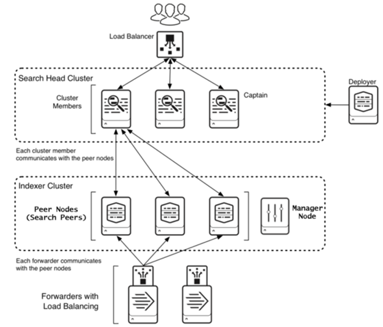
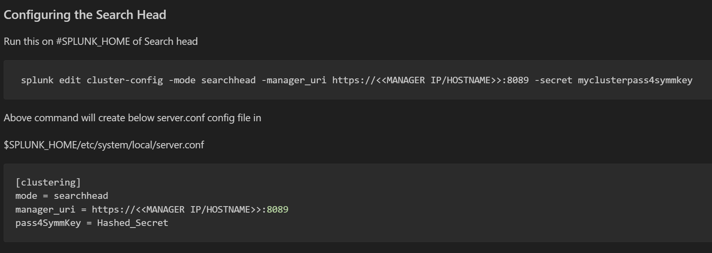

# Search Head Clustering


----
### Why SearchHead clustering
To overcome
>   Single point of failure

>   User load management issues

>   Maintaining consistent configs/KOs on multiple Search heads

### Benefits of  SearchHead clustering
> Can be scaled up and down (vertically) and Horizontally (by adding nodes) based on userload and High availability

> Searches, Search artifacts, KOs high availability.

> No downtime when upgrading/during any maintenance activies.

### Requirements
-   All memebers/search heads in a cluster should have same specifications and OS arch
-   Minimum of 3 nodes are needed to build SH cluster
-   Synchronize the system clock on all members including the indexing layer


###  SearchHead cluster
-   Search head cluster works on cluster-Memeber concept where as in Indexer cluster it works on Manager-peer concept
-   Server Roles in  SearchHead clustering
      - Captain of SearchHead cluster
      - Memeber of SearchHead cluster
      - Primary of KV store
      - Deployer
-   We can have max `50` search heads in a Search head cluster

- Captain of SearchHead cluster:
    -   It is the job scheduer in whole cluster where it distributes/delegates searches to members.
    -   All Scheduled searhes are delegated to members of cluster
    -   scheduler on enabled only on captain
    -   Shares Knowledge bundle with peer nodes.
    -   Makesures replication of search artifactes of saved searhces are replicated to memeber as per replication factor
    -   <b>Note</b>: adhoc searches/realtime searche artifacts are not replicated to other members. When user tries to fetch those results/artifacts search head will proxy to the memeber where artifacts are generated/stored.

Search artifacts are stored in `/opt/splunk/var/run/splunk/dispatch/`

- Member of SearchHead cluster:
    -   It receives instructions from captain on what scheduled search need to run.
    -   based on captian instruction and replication factor, scheduled search artifacts are replicated to other members of cluster.
    -   Scheduler on member nodes are suppressed within cluster
    -   members dont share Knowledge bundle with peer nodes.
    -   User can login to any memeber to search data.

##  Capitancy in Splunk Search head cluster
-   There are 2 types of captaincy 
    -   Dynamic Captaincy --> memebers of cluster elects one of the memeber as captain when current captain is down
    -   Static Captaincy --> it is manual election by splunk admin when there is no required/majority of members in cluster

-   For dynamic Captaincy splunk uses RAFT mechanism to elect the captain
    -   all logs releated to this election will persist in `/opt/splunk/var/run/splunk/_raft/<server>/log`

-   Members register their list of artifacts,running jobs, alerts, and search load statistics to a new captain
-   New captain enables its scheduler
-   New captain executes fixups if needed

----
----
# Building a Search head cluster
### Steps:
1.  Start Splunk on all the nodes
2.  Initialize SH cluster on all members by execuring below command
```
splunk init shcluster-config -auth <username>:<password> -mgmt_uri <URI>:<management_port> -replication_port <replication_port> -replication_factor <n> -conf_deploy_fetch_url <URL>:<management_port> -secret <security_key> -shcluster_label <label>

splunk restart
```
```
example:

splunk init shcluster-config -auth admin:changeme -mgmt_uri https://10.1.1.1:8089 -replication_port 9200 -replication_factor 3 -conf_deploy_fetch_url https://10.1.1.0:8089 -secret mySecreteSHCluster -shcluster_label Splunk_sessions

```
3.  Select one of the initialized instances to be the first cluster captain. It does not matter which instance you select for this role.
```
splunk bootstrap shcluster-captain –servers_list https://SH2:8089,https://SH3:8089,https://SH4:8089 -auth admin:changeme
```

4.  To check the overall status of your search head cluster, run this command from any member
```
splunk show shcluster-status -auth <username>:<password>
```
5.  In addition to checking the status of the search head cluster itself, it is also advisable to check the status of the KV store running on the cluster. Run this command from any member:
```
splunk show kvstore-status -auth <username>:<password>
```
6. To connect to indexer cluster manager node


-   Run below command when 
    -    When SHC can't elect a captain, run on all members before bootstrap
    -   When SHC has an active captain but a member can't join, run on the failing members
    ```
        splunk clean raft
    ```


