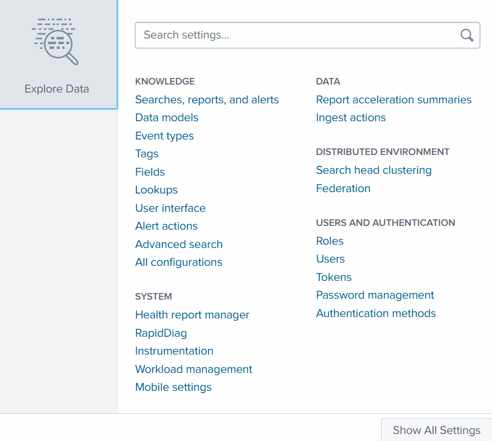
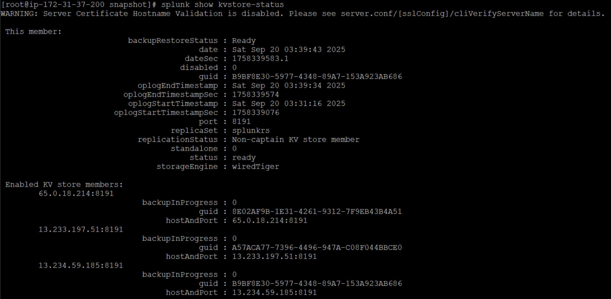

---------- Deployer-------------
65.1.131.160


----- SH --------

13.234.59.185

13.233.197.51

65.0.18.214

  
ON Deployer
```
[shclustering]
pass4SymmKey = mySecreteSHCluster
shcluster_label = Splunk_sessions
```

ON SH0
```
splunk init shcluster-config -auth admin:Changeme123 -mgmt_uri https://13.234.59.185:8089 -replication_port 9200 -replication_factor 2 -conf_deploy_fetch_url https://65.1.131.160:8089 -secret mySecreteSHCluster -shcluster_label Splunk_sessions
```


ON SH1
```
splunk init shcluster-config -auth admin:Changeme123 -mgmt_uri https://13.233.197.51:8089 -replication_port 9200 -replication_factor 2 -conf_deploy_fetch_url https://65.1.131.160:8089 -secret mySecreteSHCluster -shcluster_label Splunk_sessions
```

ON SH2
```
splunk init shcluster-config -auth admin:Changeme123 -mgmt_uri https://65.0.18.214:8089 -replication_port 9200 -replication_factor 2 -conf_deploy_fetch_url https://65.1.131.160:8089 -secret mySecreteSHCluster -shcluster_label Splunk_sessions
```

Bootstrap one of the memeber as captian.
```
splunk bootstrap shcluster-captain -servers_list "https://13.234.59.185:8089,https://13.233.197.51:8089,https://65.0.18.214:8089" -auth admin:Changeme123
```


Before:


After



SHcluster-status:


KVSTORE:



PROXYING


Bundles in Deployer


