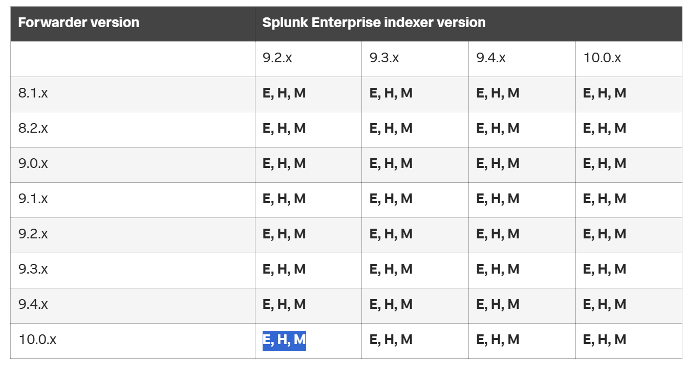
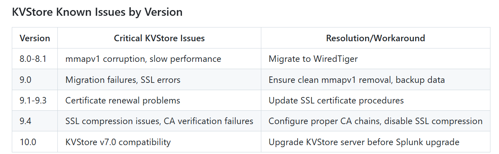
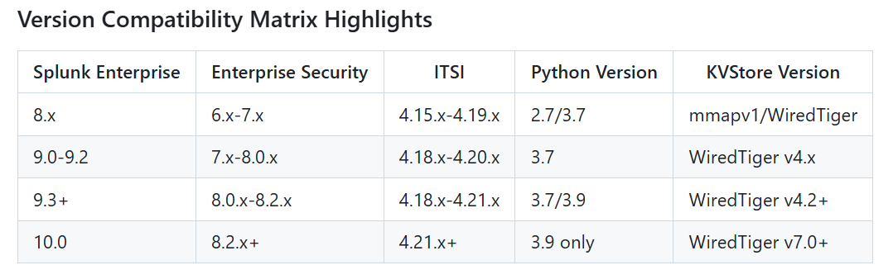

UF
HF
Indexer
Standalone search head
IndexerClustering (Master Node, Peers)
SHclustering (SHMembers, Deployer)
Licensing (Manager, peer)
DeploymentServer (clients, app, serverclass)

inputs.conf
outputs.conf
props.conf
transforms.conf
authentication.conf
authorize.conf
server.conf
web.conf
serverclass.conf
deploymentclient.conf

====================================================

Backups:

On All Nodes.
/opt/splunk -->
/opt/splunk/etc/apps
/opt/splunk/etc/auth
/opt/splunk/etc/system/local

ON Manager Node:
/opt/splunk/etc/manager-apps

on Deployer
/opt/splunk/etc/shcluster/apps

On SH/SHC members
/opt/splunk/etc/users

On Deployment Server
/opt/splunk/etc/deployment-apps

on LM:
/opt/splunk/etc/licenses

====================================================

Management Nodes (DS, LM, CM, MC) --> SH, SHC --> deployer --> indexer peers (site1, site2), cluster1, cluster2 --> HF Pools

UF

https://docs.splunk.com/images/d/d3/Splunk_upgrade_order_of_ops.pdf

https://help.splunk.com/en/splunk-enterprise/release-notes-and-updates/compatibility-matrix/splunk-products-version-compatibility/compatibility-between-forwarders-and-splunk-enterprise-indexers

Prerequisites:
https://help.splunk.com/en/splunk-enterprise/release-notes-and-updates/release-notes/10.0/whats-new/welcome-to-splunk-enterprise-10.0
https://help.splunk.com/en/splunk-enterprise/get-started/install-and-upgrade/10.0/upgrade-or-migrate-splunk-enterprise/about-upgrading-to-10.0-read-this-first
https://help.splunk.com/en/splunk-enterprise/get-started/install-and-upgrade/10.0/upgrade-or-migrate-splunk-enterprise/how-to-upgrade-splunk-enterprise

major config changes
Indexes added/removed
Backups
Next version tarball
Current Installed applications compatibility next splunk version 

Post checks:

