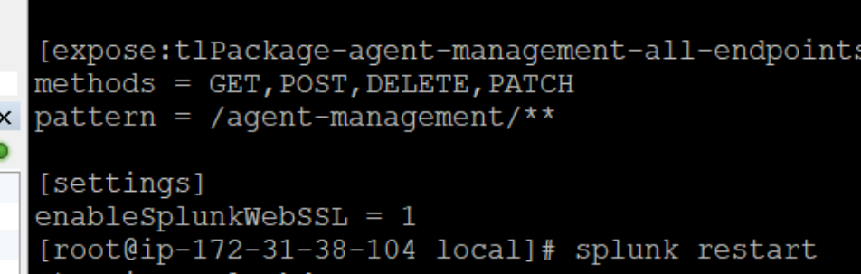
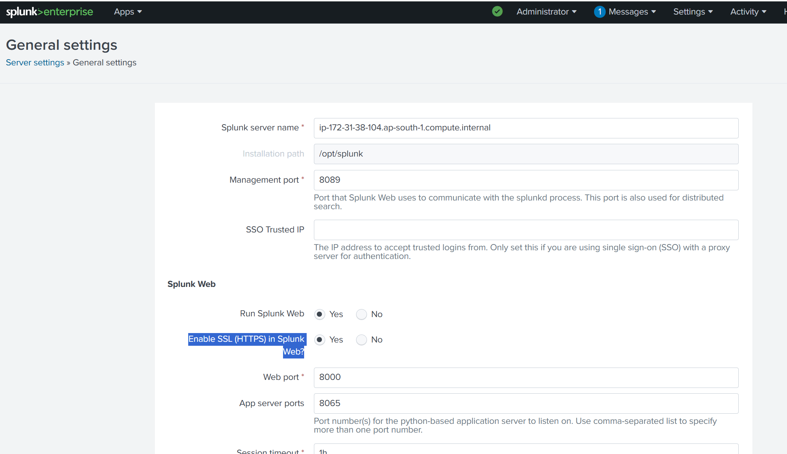
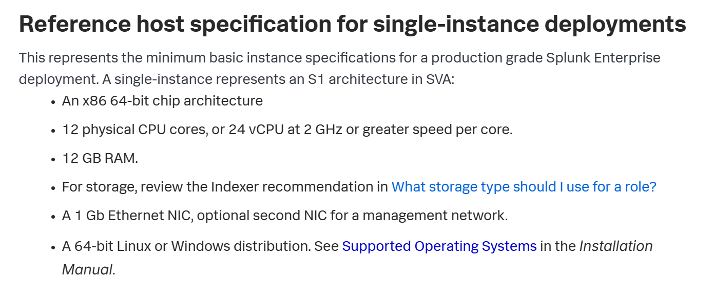
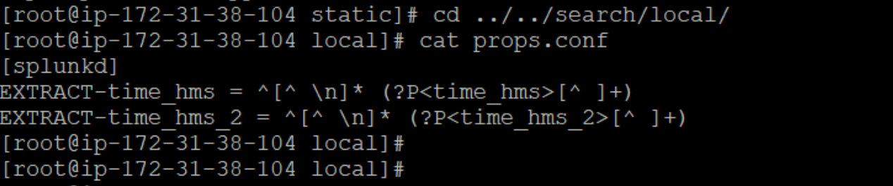
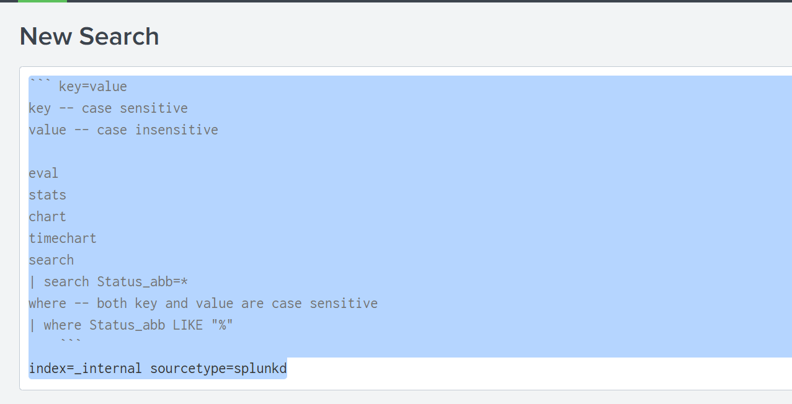
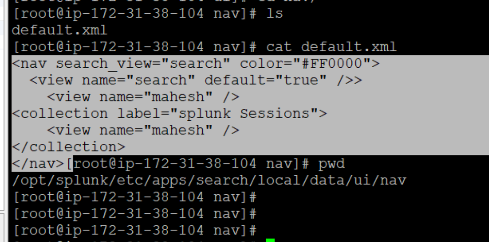
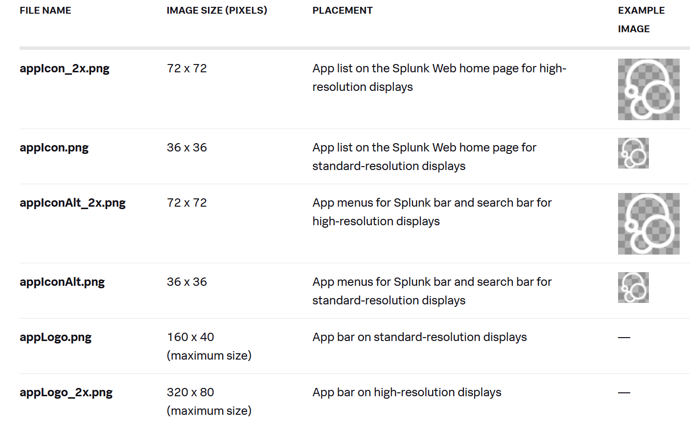

Splunk Web -- enable Web SSL (https), you need to procure your own certs(org certs)

/opt/splunk/etc/system/default/web.conf
[settings]
enableSplunkWebSSL =true



UI--> Settings--> server settings--> General Settings--Enable SSL (HTTPS) in Splunk Web?


DEFRAG, THP pages -- disable
 echo never > /sys/kernel/mm/transparent_hugepage/enabled
 echo never > /sys/kernel/mm/transparent_hugepage/defrag


##  System Requirements:
https://help.splunk.com/en/splunk-enterprise/get-started/install-and-upgrade/9.3/plan-your-splunk-enterprise-installation/system-requirements-for-use-of-splunk-enterprise-on-premises

https://help.splunk.com/en/splunk-enterprise/get-started/deployment-capacity-manual/9.4/performance-reference/reference-hardware




``` key=value   
key -- case sensitive
value -- case insensitive

eval
stats
chart
timechart
search
| search Status_abb=*
where -- both key and value are case sensitive
| where Status_abb LIKE "%"
    ```
index=_internal sourcetype=splunkd

## Navigation menu


```

### Search commands
https://help.splunk.com/en/splunk-enterprise/search/spl-search-reference/9.4/search-commands/eval




https://dev.splunk.com/enterprise/docs/developapps/createapps/